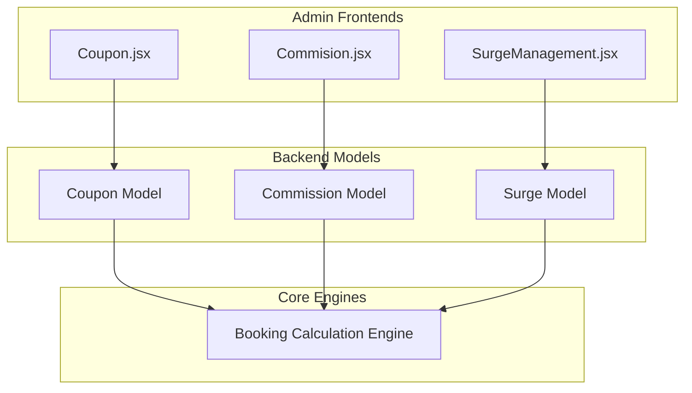

# Implementation Plan: Decoupling Coupon, Commission, and Surge Management Systems

We are separating **Coupon**, **Commission**, and **Surge** into three isolated, highly scalable business modules within our MERN stack application. This architecture ensures clean, domain-driven code separation (discount logic vs. earnings deduction logic vs. surge pricing logic) while preventing any bleed across configurations.

---

## Architecture Design



---

## 1. Coupon Management (Existing: `Coupon.jsx`)
No surcharge logic will be mixed here.

### Frontend Coupon Create Form
- **Scope Dropdown**: `Global` vs. `Zone Specific`
- **Zone Tree Dropdown (if Zone Specific)**: Indented hierarchy selection:
  ```txt
  Punjab
   ├── Ludhiana
   │   ├── Model Town
   │   ├── Civil Lines
   ├── Jalandhar
   │   ├── Cantt
  ```
  Rendered/Selected label: `Punjab > Ludhiana > Model Town`

### Backend Coupon Model (`Coupon-model.js`)
- `scope`: `['global', 'zone']`
- `zoneId`: Reference to Zone
- `zoneLevel`: `['state', 'city', 'micro']` (derived from selected Zone)
- `parentZone`: Reference to parent Zone for resolving hierarchical applicability.

### Rules of Applicability
- **Global**: Applies to all bookings regardless of location.
- **State Coupon (e.g., Punjab)**: Valid in state, child cities (Ludhiana), and micro-zones (Model Town).
- **Micro-zone Coupon (e.g., Model Town)**: Strictly valid inside Model Town.
- **Integration**: Feeds dynamically into the service booking flow (`Book-Service.jsx`) by fetching only matching coupons for the customer's detected zone.

---

## 2. Commission Management (Existing: `Commision.jsx`)
Admin configuration to deduct a percentage of bookings dynamically based on complex rules.

### Rule Engine Form Fields
1. **Rule Type Dropdown**: `Global`, `Zone Based`, `Performance Based`, `Specific Provider`
2. **Zone Selector (Tree)**: Indented tree selection (`Punjab > Ludhiana > Model Town`)
3. **Performance Selector**: `All`, `Bronze`, `Silver`, `Gold`, `Platinum`
4. **Specific Provider Selector**: Search and select specific provider
5. **Commission Percent**: Decimal value (e.g., `10%`)

### Backend Model (`Commission-model.js`)
```js
{
  scope: { type: String, enum: ['global', 'zone', 'performance', 'provider'] },
  zoneId: { type: Schema.Types.ObjectId, ref: 'Zone' },
  zoneLevel: String,
  providerPerformance: { type: String, enum: ['All', 'Bronze', 'Silver', 'Gold', 'Platinum'] },
  providerId: { type: Schema.Types.ObjectId, ref: 'Provider' },
  commissionPercent: { type: Number, required: true },
  priority: { type: Number, required: true }
}
```

### Precedence Resolution Logic
During provider payment calculation, rules resolve in strict descending order of priority:
1. **Priority 1**: `Specific Provider`
2. **Priority 2**: `Zone + Performance`
3. **Priority 3**: `Zone Default`
4. **Priority 4**: `Global`

*Example:* Rahul (GOLD provider) accepts a booking in Punjab.
- Rule 1 (Punjab default): `12%`
- Rule 2 (Punjab + GOLD): `10%`
- Rule 3 (Provider Rahul): `8%`
- **Applied Commission**: **8%** (Priority 1 wins).

---

## 3. Surge Management (New Module ✅)
A dedicated, isolated module to handle dynamic price increases (opposite of Coupon).

### Proposed Frontend [NEW] `client/src/pages/Admin/SurgeManagement.jsx`
Contains the CRUD interface for handling surge charges.
- **Charge Type**: Dropdown selection:
  - `Rain Charge`
  - `Traffic Charge`
  - `Night Charge`
  - `High Demand Charge`
  - `Festival Charge`
  - `Manual Custom Charge`
- **Scope**: `Global` vs. `Zone Specific`
- **Zone Tree Dropdown**: Hierarchical zone selector
- **Charge Mode**: `Flat` (absolute value e.g., ₹50), `Percentage` (e.g., 10%), or `Multiplier` (e.g., 1.5x)
- **Value**: Amount/Percent/Multiplier
- **Time Window**: Start and End times (e.g., `18:00 - 23:00`)
- **Active Toggle**: ON/OFF switch

### Proposed Backend Files
1. **Model** [NEW] `server/models/Surge-model.js`
   ```js
   {
     chargeType: { type: String, enum: ['rain', 'traffic', 'night', 'demand', 'festival', 'custom'] },
     scope: { type: String, enum: ['global', 'zone'] },
     zoneId: { type: Schema.Types.ObjectId, ref: 'Zone' },
     mode: { type: String, enum: ['flat', 'percentage', 'multiplier'] },
     value: { type: Number, required: true },
     startTime: String, // HH:MM
     endTime: String, // HH:MM
     active: { type: Boolean, default: true }
   }
   ```
2. **Controller** [NEW] `server/controllers/Surge-controller.js`
3. **Routes** [NEW] `server/routes/Surge-routes.js`

---

## 4. Billing & Display Integrations

### Client-side Price Calculations (`Book-Service.jsx` & `BookingConfirmation.jsx`)
Render clear breakdowns so users see their charges:
```txt
Base Price       ₹500
Rain Charge      +₹40
Traffic Charge   +₹20
Coupon           -₹50
----------------------
Final Total      ₹510
```

### Provider Earnings Display (`Provider-Booking.jsx`)
Ensure transparent earnings information:
```txt
Customer Paid:      ₹600
Commission (10%):  -₹60
----------------------
Provider Receives:  ₹540
```

### Admin Dashboard Zone Analytics
Add charts and tables showing:
- High surge zones
- Revenue generated by zone
- Commissions earned by zone
- Coupon usage frequency by zone

---

## Recommended Execution Plan

1. **Step 1: Zone Selector Tree Integration**
   Add zone tree utility matching the `Punjab > Ludhiana > Model Town` pattern to both `Coupon.jsx` and `Commision.jsx`.
2. **Step 2: Commission Rule Precedence Engine**
   Implement the backend priority calculation logic.
3. **Step 3: Surge Management Setup**
   Build `Surge-model.js`, controllers, routes, and `SurgeManagement.jsx`.
4. **Step 4: Dynamic Invoice Breakdown Integration**
   Integrate the dynamic surcharge math and coupon discount subtractions in `Book-Service.jsx`, `BookingConfirmation.jsx`, and backend order calculation functions.
